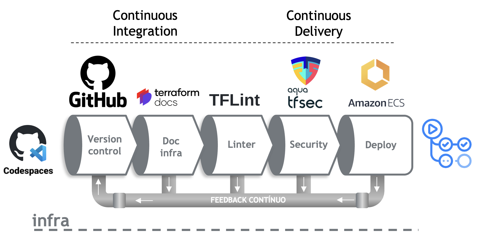
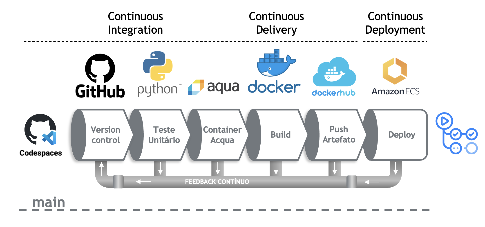
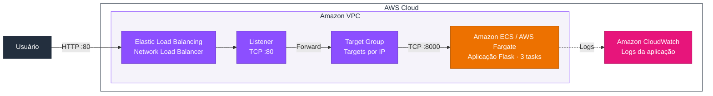

# Lab-03 — CI/CD de uma aplicação no Amazon ECS

## Contexto

Após construir imagens Docker e executar serviços com Compose, o próximo passo é automatizar a entrega de uma aplicação em um ambiente de nuvem. Esse fluxo envolve provisionar infraestrutura, validar o código, publicar a imagem e atualizar os contêineres em execução com rastreabilidade entre commit e versão implantada.

Neste laboratório, você vai utilizar **Terraform** para definir a infraestrutura na AWS e **GitHub Actions** para executar os workflows de provisionamento e deploy. A aplicação de exemplo utiliza **Python e Flask**, sua imagem é publicada no **Docker Hub** e sua execução é gerenciada pelo **Amazon ECS**. O **GitHub Codespaces** será o ambiente de edição do código; os workflows serão executados nos runners do GitHub Actions.

O laboratório está dividido em duas etapas: primeiro, provisionar a infraestrutura compartilhada e depois realizar o deploy da aplicação, na infraestrutura provisionada.

## Objetivos

- Provisionar infraestrutura como código e manter o state do Terraform em um backend S3.
- Configurar secrets e variáveis utilizados pelos workflows para acessar AWS e Docker Hub.
- Executar validações de infraestrutura com as ferramentas previstas no roteiro: TFLint, tfsec e terraform-docs.
- Automatizar testes da aplicação, build da imagem, análise de vulnerabilidades com Trivy e publicação no Docker Hub.
- Identificar a imagem por uma tag que combina a versão da aplicação e parte do SHA do commit.
- Atualizar a task definition e realizar o deploy do serviço no ECS.
- Validar a execução das tasks e acessar a aplicação pelo Network Load Balancer.

## Workflow

### CI/CD - Infra

### CI/CD/CD - App

## Serviços e ferramentas utilizadas no laboratório

| Componente | Responsabilidade |
| --- | --- |
| GitHub | Versionar o código da aplicação, os arquivos Terraform e os workflows. |
| GitHub Codespaces | Disponibilizar editor e terminal para desenvolver os arquivos do laboratório. |
| GitHub Actions | Executar os processos de validação, build, publicação e deploy. |
| Terraform | Declarar e provisionar os recursos da AWS utilizados pela aplicação. |
| Amazon S3 | Armazenar o state remoto do Terraform. |
| Docker Hub | Armazenar as imagens publicadas pela pipeline da aplicação. |
| Amazon ECS | Gerenciar o serviço e as tasks que executam os contêineres. |
| Task definition | Definir imagem, recursos, portas, roles e configuração de logs dos contêineres. |
| Network Load Balancer (NLB) | Receber as conexões e encaminhá-las às tasks pelo target group. |
| Amazon CloudWatch Logs | Receber os logs da aplicação conforme a configuração da task definition. |

No roteiro, o acesso à aplicação segue o caminho **cliente → DNS do NLB → listener TCP na porta 80 → target group → aplicação na porta 8000**.

## Arquitetura do laboratório

O Network Load Balancer recebe as requisições pelo listener TCP na porta 80, que as encaminha ao target group. O target group direciona o tráfego para os IPs das tasks na porta 8000. O serviço no Amazon ECS com AWS Fargate mantém três tasks em execução, representadas por um único bloco.

O provisionamento é automatizado por GitHub Actions e Terraform, com state no S3. As tasks utilizam a imagem publicada no Docker Hub. A VPC e as subnets já existem e são referenciadas pelo Terraform.

## Pré-requisitos

- Ter concluído o [Lab-01 — Imagens Docker](../Lab-01/README.md) e o [Lab-02 — Docker Compose](../Lab-02/README.md), ou possuir conhecimento equivalente.
- Ter acesso ao **AWS Academy Learner Lab** disponibilizado pelo professor, com sessão ativa e saldo suficiente para o exercício.
- Possuir uma conta GitHub com permissão para configurar Actions, secrets, variáveis e Codespaces no repositório de trabalho.
- Possuir uma conta Docker Hub e um token com permissão para publicar imagens.
- Conhecer comandos básicos de Git e a estrutura de arquivos YAML e Dockerfile.

## Organização e ordem de execução

| Etapa | Roteiro | Entrega esperada |
| --- | --- | --- |
| 1. Infraestrutura | [Provisionar a infraestrutura](Infra/README.md) | S3, Cluster ECS, NLB e Security Group. |
| 2. Aplicação | [Construir e implantar a aplicação](app/README.md) | Imagem publicada no Docker Hub e Serviço ECS deployado no cluster provisionado, com acesso via NLB. |

As pastas `infra/` e `app/` deste laboratório contêm os roteiros. Siga as instruções de cada etapa para criar os arquivos executáveis e workflows no repositório de trabalho; os arquivos Markdown não executam o provisionamento.

### Etapa 1 — Pipeline de infraestrutura

Comece pelo [roteiro de infraestrutura](Infra/README.md):

1. Inicie a sessão no AWS Academy e obtenha as credenciais temporárias.
2. Crie o bucket S3 que será utilizado como backend do Terraform.
3. Prepare o repositório de trabalho e configure as secrets e a variável de região.
4. Abra o repositório no Codespaces e prepare a branch `infra`.
5. Crie o workflow `Deploy Infra` e os arquivos Terraform definidos no roteiro.
6. Envie as alterações para a branch `infra`, acompanhe o workflow e valide os recursos no console AWS.

**Ponto de verificação:** conclua o provisionamento e confirme os recursos antes de iniciar o deploy da aplicação. A segunda etapa depende dessa infraestrutura.

### Etapa 2 — Pipeline da aplicação

Com a infraestrutura disponível, siga o [roteiro da aplicação](app/README.md):

1. Trabalhe na branch `main` e crie a aplicação Flask, seus testes e o Dockerfile.
2. Configure as credenciais do Docker Hub no GitHub Actions.
3. Prepare a task definition e os arquivos Terraform do deploy.
4. Crie o workflow `Deploy App`, que executa testes, constrói a imagem, verifica vulnerabilidades e publica o artefato.
5. Envie as alterações para `main` e acompanhe a atualização do serviço no ECS.
6. Verifique as tasks, os health checks e a resposta da aplicação pelo DNS do NLB.

**Ponto de verificação:** a imagem referenciada no deploy deve corresponder à tag produzida no job de build da mesma execução.

## Branches e gatilhos dos workflows

| Branch | Workflow | Gatilho definido nos exemplos |
| --- | --- | --- |
| `infra` | `Deploy Infra` | Push na branch `infra`. |
| `main` | `Deploy App` | Push na branch `main`. |

Um merge nessas branches também gera um push e pode iniciar o workflow correspondente. Confira a branch antes de enviar alterações, pois os workflows podem modificar recursos na AWS.

A pipeline de infraestrutura mantém o ambiente necessário para a execução. A pipeline da aplicação produz uma nova imagem e atualiza o serviço para utilizá-la. Essa separação permite alterar o código da aplicação sem executar novamente todo o provisionamento da infraestrutura compartilhada.

## Validação do lab

- [ ] O workflow `Deploy Infra` concluiu o provisionamento.
- [ ] O state da infraestrutura está armazenado no bucket S3 configurado.
- [ ] Os testes da aplicação e a verificação de vulnerabilidades passaram conforme os critérios do workflow.
- [ ] A imagem está publicada no Docker Hub com a tag gerada pela pipeline.
- [ ] O serviço ECS utiliza a task definition com a imagem dessa execução.
- [ ] As tasks previstas estão em execução e os health checks indicam uma aplicação saudável.
- [ ] A aplicação responde pelo DNS do NLB.

## Encerramento do ambiente

Ao finalizar, remova os recursos provisionados para evitar consumo desnecessário do saldo do laboratório. A ordem deve respeitar as dependências: primeiro os recursos do deploy da aplicação e depois a infraestrutura compartilhada.

Depois, encerre a sessão do AWS Academy e pare ou exclua o Codespaces, salvando antes o trabalho que deseja manter. Parar o Codespaces não remove os recursos provisionados na AWS.

## Material de apoio

- [GitHub Actions — infraestrutura](Infra/github-actions.md)
- [Terraform — infraestrutura](Infra/terraform.md)
- [GitHub Actions — aplicação](app/github-actions.md)
- [Terraform — aplicação](app/terraform.md)
